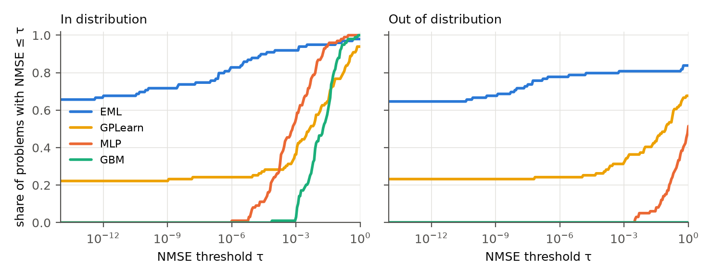
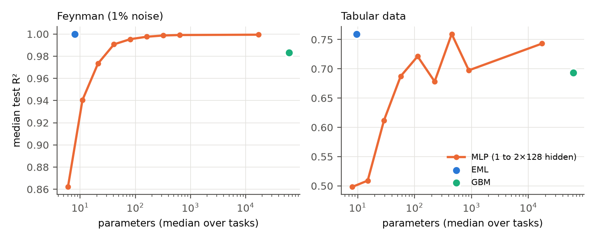
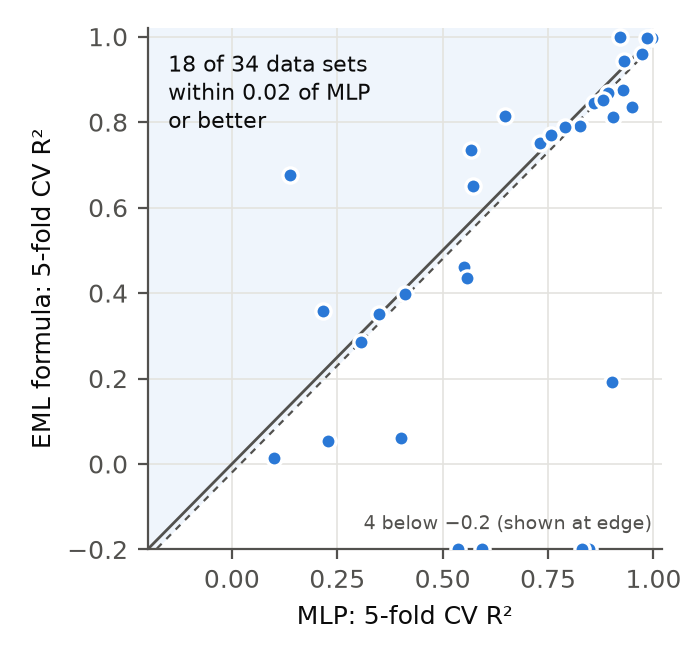

# Benchmarking EML based Neural Networks

Odrzywołek (2026, [arXiv:2603.21852](https://arxiv.org/abs/2603.21852)) showed that one operator,
**eml(x, y) = eˣ − ln y**, together with the constant 1, generates every elementary function. This repo asks
whether a neural network built **only** from that operator is useful in practice. Is it accurate? Is it
explainable? Can it match a regular NN? Is it cheaper?

We built trainable EML networks (`emlkit`) and tested 18 claims against pre-declared pass/fail thresholds
([`CLAIMS.md`](CLAIMS.md), committed before the results). Benchmarks: 99 Feynman physics equations, 15 real physics data
sets, and 34 general tabular data sets, against an MLP, gradient boosting, random forest, ridge regression and
genetic-programming symbolic regression (GPLearn).

## Results

<!-- RESULTS:START -->
**Does it perform very well?**

| # | Claim | Evidence | Verdict |
|---|---|---|---|
| C1 | EML recovers exact laws | 82% of held-out non-trig problems | ✅ supported |
| C2 | at least as good as GP symbolic regression | EML 65% vs GPLearn 26% | ✅ supported |
| C4 | extrapolates far better than MLP / GBM | OOD R²>0.99 on 81% (EML) vs 5% (MLP), 0% (GBM) | ✅ supported |
| C5 | survives 1% label noise | recovery 34% at 1% vs 65% noiseless | ✅ supported |
| C7 | best model on some real data sets | 15 data sets: bode, kepler, leavitt, planck, rydberg, schechter, tully_fisher, 192_vineyard, … | ✅ supported |

**Is it explainable while staying accurate?**

| # | Claim | Evidence | Verdict |
|---|---|---|---|
| C6 | models are readable | median size 14 (Feynman), 25 (real data) SymPy nodes | ✅ supported |
| C8 | accurate while explainable (physics data) | median gap to best baseline +0.001 R² | ✅ supported |
| C18 | pruning keeps accuracy | 45% fewer parameters, validation R² change +0.0000 (medians) | ❌ not supported |

**Is it comparable to a regular neural network?**

| # | Claim | Evidence | Verdict |
|---|---|---|---|
| C3 | matches an MLP in distribution | R²>0.999 on 92% (EML) vs 55% (MLP) | ✅ supported |
| C9 | comparable to a NN (tabular data) | within 0.02 of the MLP or better on 53% of data sets | ✅ supported |
| C16 | beats a parameter-matched NN | EML ≥ parameter-matched MLP on 95% of tasks | ✅ supported |

**Does it need less compute?**

| # | Claim | Evidence | Verdict |
|---|---|---|---|
| C13 | same accuracy with far fewer parameters (Feynman) | matching MLP needs 10× more parameters (median; no MLP matches EML on 21%) | ✅ supported |
| C14 | same accuracy with fewer parameters (tabular) | matching MLP needs 4× more parameters (median; no MLP matches EML on 21%) | 🟡 partly |
| C15 | cheaper inference | 2×128 MLP is 147× slower per prediction (median) | ✅ supported |
| C17 | training cost comparable to an MLP | EML trains 184× slower (median) | ❌ not supported |

**Method and tooling**

| # | Claim | Evidence | Verdict |
|---|---|---|---|
| C10 | every training component matters | wide -30 pts; noVP -27 pts; noLM -19 pts; untyped -19 pts; noLogVP -11 pts; noQ -11 pts; noHalving -8 pts; skip -0 pts | ❌ not supported |
| C11 | compiler is exact | max error 1.7e-15 over 17 expressions | ✅ supported |
| C12 | limitation: trigonometric laws | 0% recovered on trig problems | ✅ supported |



*Share of Feynman problems below each test-error threshold, in and out of distribution.*



*Accuracy against parameter count: EML formula vs. MLPs of every size and gradient boosting.*



*EML formula vs. MLP, cross-validated R² on 34 tabular data sets.*

**Audit notes**

- EML fails catastrophically (CV R² < −1) on 8 data sets (1096_FacultySalaries, 659_sleuth_ex1714, 695_chatfield_4, 706_sleuth_case1202, first_principles_absorption, first_principles_newton, first_principles_supernovae_zg, first_principles_supernovae_zr): on small, noisy data a learned exp(·) can blow up on held-out folds. Nothing clips the predictions, and the pre-registered numbers include these failures.
- C9 compares against the MLP, which is weak on the smallest data sets. Against the *best* baseline per data set, EML is within 0.02 R² or better on 41% of tabular data sets.
- `561_cpu`: the target equals the *estimated* relative performance (ERP) of the original 1987 study (correlation 1.0 with the UCI ERP column), i.e. it is itself a regression formula. EML's R² = 1.000 there means it recovered that formula; it is not a typical real-world result.
- Some C7 wins come from data sets so small that several baselines collapse (Bode n = 8, Kepler n = 6, leave-one-out). Kepler is still informative: EML finds period ∝ a^1.5 with R² = 1.000 vs 0.865 for the MLP.
- Physics formulas are not always clean laws. Kepler comes out as 359.9·a^1.509 times near-1 factors (true: 365.25·a^1.5). On `ideal_gas` EML fails (R² 0.38): that target is ln P = ln n + ln R + ln T − ln V, a plain *sum* of log-features, and the curriculum has no stage for that (every stage routes the output through exp/ln nodes). Adding an additive-log stage is the obvious fix; we did not apply it, to keep the pre-registered protocol intact.
- The exported formula and `model.predict` disagree (|ΔR²| > 0.01) on 7% of compute-benchmark test sets. The network clamps exp(·) and guards ln|·|; the printed formula does not. All reported accuracies use `model.predict`. An earlier version of the compute benchmark scored the raw formula and is kept in `results/superseded/`.
- The SRBench-style recovery check is conservative. It rounds constants to 3 decimals, which can hide an exact recovery (e.g. II.24.17 is recovered exactly but scored as a miss).

<!-- RESULTS:END -->

Full tables: [`RESULTS.md`](RESULTS.md). Raw per-run results: [`results/`](results/).

## What an EML network is

Every unit is an EML node whose arguments are affine functions of the inputs, of ln|inputs|, and of earlier units:

```
E unit  = eml(a, 1)      = exp(a)        products, powers, exp(monomial)
L unit  = 1 - eml(0, c)  = ln|c|         logs of sums
output  = linear read-out, or eml(·, 1)  log-space output: products of factors become sums
```

A monomial C·xᵃ·yᵇ is one unit, and ρ₀/√(1 − v²/c²) is three. After training, weights are pruned and snapped to
multiples of ½, so the trained network **is** a formula. Training uses five ingredients:
1. least-squares (variable-projection) read-out, in log space when y has a constant sign;
2. successive halving over restarts;
3. annealed quantisation of exponents;
4. Levenberg–Marquardt verification of each prune or snap;
5. an Occam curriculum of growing architectures with BIC selection.

The ablation claim (C10) measures which of these actually matter.

## Use it

```bash
pip install -e .
```

```python
import numpy as np
from emlkit import EMLRegressor

X = np.random.default_rng(0).uniform(1, 5, size=(1000, 3))          # q1, q2, r
y = X[:, 0] * X[:, 1] / (4 * np.pi * X[:, 2] ** 2)                    # Coulomb's law

m = EMLRegressor(feature_names=["q1", "q2", "r"]).fit(X, y)
m.formula()            # '0.07958*q1*q2/r**2'   (0.07958 = 1/4π)
m.predict(X)           # scikit-learn API; m.latex(), m.lambdify(), m.pareto_formulas()
```

`emlkit.tree` compiles any elementary SymPy expression into a pure `eml`/`1` tree, verifies it numerically and
searches for the shortest tree (`compile_expr`, `verify`, `search`). See [`examples/`](examples/).

## Reproduce

All experiments run on [Modal](https://modal.com), one CPU core per run, with the package versions recorded in the logs.
The local runners in `benchmarks/` take the same arguments.

```bash
pip install -e ".[bench]" modal
modal run benchmarks/modal_app.py --kind feynman    --methods EML,MLP,GBM,RF,Linear,GPLearn --noise 0.0,0.01
modal run benchmarks/modal_app.py --kind feynman    --problems ablation --out results/ablation.jsonl \
          --methods EML-noLogVP,EML-noVP,EML-skip,EML-wide,EML-untyped,EML-noQ,EML-noLM,EML-noHalving
modal run benchmarks/modal_app.py --kind realworld  --group physics --methods EML,MLP,GBM,RF,Linear,GPLearn
modal run benchmarks/modal_app.py --kind realworld  --group tabular --methods EML,MLP,GBM,RF,Linear,GPLearn
modal run benchmarks/modal_app.py --kind efficiency
python benchmarks/analyze.py      # verdicts, RESULTS.md, figures, this README's results section
pytest                             # library tests
```

## Layout

```
emlkit/          library: EMLNet (PyTorch), EMLRegressor (scikit-learn), LM polishing, pure-EML compiler
benchmarks/      data loaders, baselines, runners (local + Modal), analysis
results/         raw JSON-lines results of every run
paper/           short paper draft (index.html, paper.pdf) generated from the same results
CLAIMS.md        claims and thresholds, fixed before the results
RESULTS.md       generated tables
```

## Paper

[`paper/paper.pdf`](paper/paper.pdf) is a short write-up of the same results, rebuilt with
`python benchmarks/build_paper.py && benchmarks/render_pdf.sh`. Posting to arXiv (cs.LG) requires an endorsement
from an existing cs.LG author; since January 2026 an institutional email alone does not qualify.

## Scope and limitations

The runs use one seed per configuration with default hyper-parameters for every method, and GPLearn is the only
genetic-programming baseline (PySR or Operon would be stronger). EML's known blind spots are trigonometric laws and
products that change sign. Both are measured, not hidden (C12, RESULTS.md).

## Citation

```bibtex
@misc{haritas2026emlbench,
  title  = {Benchmarking EML based Neural Networks},
  author = {Haritas, Hrishikesh K},
  year   = {2026},
  url    = {https://github.com/hrishikeshkh/benchmarking-eml-neural-networks}
}
@article{odrzywolek2026eml,
  title   = {All elementary functions from a single binary operator},
  author  = {Odrzywo{\l}ek, Andrzej},
  journal = {arXiv preprint arXiv:2603.21852},
  year    = {2026}
}
```

MIT License.
